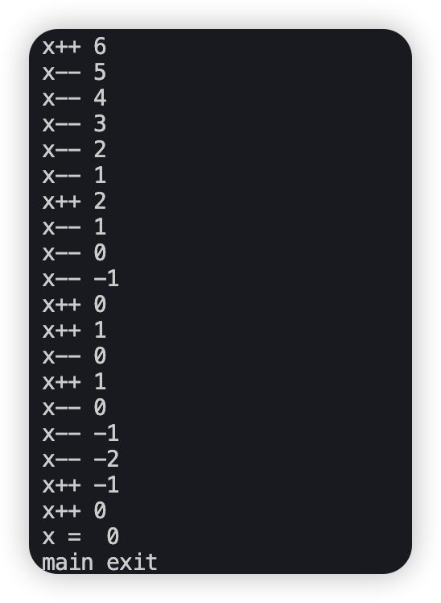
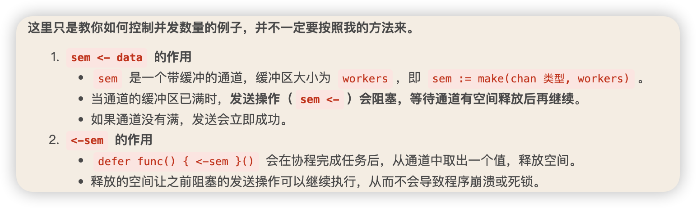

<!-- more -->

# 前言
```golang
package cmd

import (
	"fmt"
	"github.com/chainreactors/gogo/v2/core"
	"github.com/chainreactors/logs"
	"github.com/jessevdk/go-flags"
	"io/ioutil"
	"log"
	"os"
)

func init() {
	log.SetOutput(ioutil.Discard)
}

func Gogo() {
	var runner core.Runner
	defer os.Exit(0)
	parser := flags.NewParser(&runner, flags.Default)
	parser.Usage = core.Usage()
	_, err := parser.Parse()
	if err != nil {
		if err.(*flags.Error).Type != flags.ErrHelp {
			fmt.Println(err.Error())
		}
		return
	}
	if ok := runner.Prepare(); !ok {
		os.Exit(0)
	}
	logs.Log.Important(core.Banner())
	err = runner.Init()
	if err != nil {
		logs.Log.Error(err.Error())
		return
	}
	runner.Run()

	if runner.Debug {
		// debug模式不会删除.sock.lock
		logs.Log.Close(false)
	} else {
		logs.Log.Close(true)
	}
}
```

图片test


# 基础语法

类型转换
```golang
	// 类型转换
	// 相同类型转换
	a := 10
	fmt.Printf("a type is %T\n", a)
	b := float64(a)
	fmt.Printf("b type is %T\n", b)

	// 不同类型转换
	// 借助strconv包
	c := strconv.Itoa(a)
	fmt.Printf("c type is %T\n", c)
```

## 数组

goalng中的数组定义也同样有点反常识
```golang
arr := [length]type{values}
arr := [3]int{1, 2, 3}

// 自动计算数组长度
arr1 := [...]string{"a", "b", "c"}
fmt.Println(arr1)
```
数组无法使用append，因为长度是固定的

## 切片

理解为动态数组，可以使用append扩容的数组
```go
	// 切片
	// slice := []type{values}
	slice := []int{1, 2, 3}
	fmt.Println(slice)

	arr := make(数组类型, 长度, 容量) //长度不能超过容量，容量是为了添加元素时扩容的单位
	arr := make(数组类型，长度) //容量默认和长度一样
	// make的时候注意容量的大小，太大了会导致添加元素时占用系统的开销过大
	slice := make([]int, 3) //容量为3
	fmt.Println(cap(slice)) // 3
	slice = append(slice, 1) //添加元素，容量扩充为6
	fmt.Println(slice)
	fmt.Println(cap(slice)) // 6
```

## 结构体

```go
	// 结构体
	type Host struct {
		ip string
		port int
	}
	host1 := Host{
		ip:"127.0.0.1",
		port:8080,
	}
	fmt.Println(host1)

	// 结构体方法
	// 结构体方法有两种形式：值接收者方法和指针接收者方法。

	//值接收者方法：在方法内部，无法修改结构体的值。
	func (h Host) GetIp() string {
		return h.ip
	}
	//指针接收者方法：在方法内部，可以修改结构体的值。
	func (h *Host) SetPort(port int) {
		h.port = port
	}

	host1 := Host{
		ip:   "127.0.0.1",
		port: 8080,
	}
	fmt.Println(host1)
	fmt.Println(host1.GetIp())
	host1.SetPort(8081)
	fmt.Println(host1)
```

## 指针
```go
	// 指针
	// 指针是一个变量，它存储了一个内存地址。
	// 指针类型的变量可以指向任何类型的值。
	var p *int
	var num int = 10
	p = &num
	fmt.Println(*p) // 输出 10
	fmt.Println(p) // 输出地址值 0xc000010080
```

## map
```go
// map
	m := map[string]Host{}
	m["host1"] = host1
	m["host2"] = Host{
		ip: "192.168.2.1",
		port: 8082,
	}
	fmt.Println(m) //map[host1:{127.0.0.1 8081} host2:{192.168.2.1 8082}]
	delete(m, "host1") // 删除键值对
```

## 常用函数
```go
函数 	  函数作⽤
Contains 检查字符串是否包含⼦字符串
ContainsAny 检查字符串是否包含任何⼀个给定字符
ContainsRune 检查字符串是否包含指定的 rune 字符
Count 计算⼦字符串在字符串中出现的次数
EqualFold 忽略⼤⼩写⽐较两个字符串是否相等
Fields 将字符串按空⽩字符分割成切⽚
HasPrefix 检查字符串是否以指定前缀开头
HasSuffix 检查字符串是否以指定后缀结尾
Index 返回⼦字符串在字符串中第⼀次出现的位置
IndexAny 返回字符串中任意⼀个字符第⼀次出现的位置
IndexByte 返回指定字节在字符串中第⼀次出现的位置
IndexRune 返回指定 rune 字符在字符串中第⼀次出现的位置
Join 将字符串切⽚⽤指定分隔符连接成⼀个字符串
LastIndex 返回⼦字符串在字符串中最后⼀次出现的位置
LastIndexAny 返回字符串中任意⼀个字符最后⼀次出现的位置
Repeat 重复字符串指定次数
Replace 替换字符串中的⼦字符串
ReplaceAll 替换字符串中的所有⼦字符串
Split 将字符串按指定分隔符分割成切⽚
SplitAfter 将字符串按指定分隔符分割成切⽚，保留分隔符
SplitAfterN 将字符串按指定分隔符分割成切⽚，保留分隔符，最多分割 N 次
SplitN 将字符串按指定分隔符分割成切⽚，最多分割 N 次
Title 将字符串的每个单词的⾸字⺟⼤写
ToLower 将字符串转换为⼩写
ToUpper 将字符串转换为⼤写
Trim 去除字符串两端的指定字符
TrimSpace 去除字符串两端的空⽩字符
TrimPrefix 去除字符串前缀
TrimSuffix 去除字符串后缀
NewReplacer 创建⼀个字符串替换器
```

## 协程
```go
	// go协程
	ch := make(chan int, 3) //有缓冲通道的协程
	ch <- 1
	ch <- 2
	ch <- 3
	close(ch) //取出内容时要先关闭通道，否则会panic，不然一直等待会死锁
	for i := range ch {
		fmt.Println(i)
	}

	// 无缓冲通道的协程
	ch1 := make(chan int) //无缓冲通道的协程
	// 需要使用goroutine来启动协程
	go func() {
		ch1 <- 1
		ch1 <- 2
		ch1 <- 3
		close(ch1) // 在发送协程中关闭通道
	}()
	for i := range ch1 {
		fmt.Println(i)
	}

	// 等协程
var wg sync.WaitGroup
wg.Add(1)
wg.Done()  //这个函数里面其实是执行wg.Add(-1)
wg.Wait() // 这个函数里面其实是执行for {if wg.counter == 0 {break}}

func wq() {
	for i := 0; i < 10; i++ {
		fmt.Println("enter goroutine wg.Add(1)")
		wg.Add(1)
		go func(n int) {
			fmt.Println("I'm grountine ", n)
			fmt.Println("enter goroutine wg.Done()")
			defer wg.Done()
		}(i)
	}
	wg.Wait()
	fmt.Println("all goroutine finished")
}
```

同步变量
```go
// 同步变量
sync.Mutex互斥锁

// 使用加减法队同一个变量操作，发现并不会造成一个一直加加或者减减的操作，不会死锁
func Mutex_Lock() {
	var (
		wg sync.WaitGroup
		mu sync.Mutex
		x int
	)
	var add = func() {
		defer wg.Done()
		mu.Lock()
		x++
		fmt.Println("x++", x)
		mu.Unlock()
	}
	var sub = func() {
		defer wg.Done()
		mu.Lock()
		x--
		fmt.Println("x--", x)
		mu.Unlock()
	}

	for i := 0; i < 100; i++ {
		wg.Add(1)
		go add()
		wg.Add(1)
		go sub()
	}

	wg.Wait()
	fmt.Println("x = ", x)
	fmt.Println("main exit")
}

```

原子变量是Go语言中用于在多个协程之间安全地读写共享变量的一种机制，它提供了比互斥锁（Mutex）更轻量级的同步方式。


1. **原子性**：操作要么完全执行，要么完全不执行，不会出现中间状态
2. **无锁**：不需要像互斥锁那样获取和释放锁，性能更高
3. **适用场景**：适合简单的计数器、标志位等场景


Go语言通过`sync/atomic`包提供了原子操作的支持，主要包括以下几类操作：

1. **加载（Load）**：原子地读取变量的值
2. **存储（Store）**：原子地设置变量的值
3. **添加（Add）**：原子地将值添加到变量
4. **交换（Swap）**：原子地交换变量的值
5. **比较并交换（CompareAndSwap）**：原子地比较并交换变量的值


```go
package main

import (
	"fmt"
	"sync"
	"sync/atomic"
)

func Atomic_Example() {
	var (
		wg sync.WaitGroup
		x  int32 // 使用int32类型，因为atomic包要求特定类型
	)
	
	var add = func() {
		defer wg.Done()
		// 原子地将x的值加1
		atomic.AddInt32(&x, 1)
		fmt.Println("x++", atomic.LoadInt32(&x))
	}
	
	var sub = func() {
		defer wg.Done()
		// 原子地将x的值减1
		atomic.AddInt32(&x, -1)
		fmt.Println("x--", atomic.LoadInt32(&x))
	}

	for i := 0; i < 100; i++ {
		wg.Add(1)
		go add()
		wg.Add(1)
		go sub()
	}

	wg.Wait()
	fmt.Println("x = ", x)
	fmt.Println("main exit")
}

func main() {
	Atomic_Example()
}
```

###  原子操作与互斥锁的比较
### 原子操作的优势
1. **性能更高**：原子操作通常比互斥锁更快，因为它们直接使用CPU提供的原子指令
2. **无死锁风险**：不需要获取和释放锁，避免了忘记释放锁导致的死锁
3. **更简洁**：代码更简洁，不需要Lock/Unlock成对出现

### 互斥锁的优势
1. **适用范围更广**：可以保护任意复杂的代码块
2. **更灵活**：可以保护多个变量或复杂的数据结构
3. **更易理解**：对于复杂的同步逻辑，互斥锁的代码可能更容易理解

常用的原子操作函数

```go
// 加载操作
v := atomic.LoadInt32(&x)

// 存储操作
atomic.StoreInt32(&x, 10)

// 添加操作（可以是负数，实现减法）
atomic.AddInt32(&x, 1)  // 加1
atomic.AddInt32(&x, -1) // 减1

// 交换操作
oldValue := atomic.SwapInt32(&x, 20)

// 比较并交换操作
swapped := atomic.CompareAndSwapInt32(&x, expected, new)
```



## 并发数量控制

### 1. 使用缓冲通道作为信号量

```go
package main

import (
	"fmt"
	"net"
	"sync"
	"sync/atomic"
	"time"
)

func SemaphorePortScanner() {
	var (
		wg        sync.WaitGroup
		openPorts = make(chan int, 100)
		portCount int32
		hostname  = "127.0.0.1"
		// 创建一个容量为20的通道作为信号量
		semaphore = make(chan struct{}, 20)
	)

	fmt.Println("[+]开始扫描...")
	startTime := time.Now()

	// 扫描单个端口的函数
	var scanPort = func(port int) {
		defer func() {
			<-semaphore // 释放信号量
			wg.Done()
		}()

		address := fmt.Sprintf("%s:%d", hostname, port)
		conn, err := net.DialTimeout("tcp", address, 200*time.Millisecond)
		if err == nil {
			conn.Close()
			atomic.AddInt32(&portCount, 1)
			openPorts <- port
		}
	}

	// 启动接收结果的协程
	go func() {
		for port := range openPorts {
			fmt.Printf("[+]开放端口: %d\n", port)
		}
	}()

	// 为每个端口创建一个协程，但通过信号量控制并发数
	for port := 1; port <= 65535; port++ {
		wg.Add(1)
		semaphore <- struct{}{} // 获取信号量，如果通道已满则阻塞
		go scanPort(port)
	}

	wg.Wait()
	close(openPorts)

	fmt.Printf("[+]扫描完成，共发现 %d 个开放端口\n", atomic.LoadInt32(&portCount))
	fmt.Printf("[+]耗时: %s\n", time.Since(startTime))
}
```
### 2. 工作池模式
这种方法创建固定数量的工作协程，从任务队列中获取任务执行。
```go
package main

import (
	"fmt"
	"net"
	"sync"
	"sync/atomic"
	"time"
)

func WorkerPoolPortScanner() {
	var (
		wg        sync.WaitGroup
		openPorts = make(chan int, 100)
		portCount int32
		hostname  = "127.0.0.1"
		// 任务通道
		tasks = make(chan int, 1000)
	)

	fmt.Println("[+]开始扫描...")
	startTime := time.Now()

	// 工作协程函数
	worker := func(id int) {
		defer wg.Done()
		for port := range tasks {
			address := fmt.Sprintf("%s:%d", hostname, port)
			conn, err := net.DialTimeout("tcp", address, 200*time.Millisecond)
			if err == nil {
				conn.Close()
				atomic.AddInt32(&portCount, 1)
				openPorts <- port
			}
		}
	}

	// 启动接收结果的协程
	go func() {
		for port := range openPorts {
			fmt.Printf("[+]开放端口: %d\n", port)
		}
	}()

	// 创建固定数量的工作协程
	numWorkers := 20
	for i := 1; i <= numWorkers; i++ {
		wg.Add(1)
		go worker(i)
	}

	// 发送所有端口扫描任务
	for port := 1; port <= 65535; port++ {
		tasks <- port
	}
	close(tasks) // 关闭任务通道，通知工作协程没有更多任务

	wg.Wait()
	close(openPorts)

	fmt.Printf("[+]扫描完成，共发现 %d 个开放端口\n", atomic.LoadInt32(&portCount))
	fmt.Printf("[+]耗时: %s\n", time.Since(startTime))
}
```
### 3. 动态调整并发数量
这种方法根据系统负载或其他指标动态调整并发数量。
```go
package main

import (
	"fmt"
	"net"
	"runtime"
	"sync"
	"sync/atomic"
	"time"
)

func AdaptivePortScanner() {
	var (
		wg        sync.WaitGroup
		openPorts = make(chan int, 100)
		portCount int32
		hostname  = "127.0.0.1"
		// 控制并发的通道
		concurrencyControl = make(chan struct{}, runtime.NumCPU()*2) // 初始并发数为CPU核心数的2倍
		// 当前并发数
		currentConcurrency int32 = int32(runtime.NumCPU() * 2)
		// 扫描速度监控
		scanCount   int32
		lastCount   int32
		adjustLock  sync.Mutex
		maxConcurrency int32 = 100 // 最大并发数
	)

	fmt.Println("[+]开始扫描...")
	startTime := time.Now()

	// 并发调整协程
	go func() {
		for {
			time.Sleep(1 * time.Second)
			newCount := atomic.LoadInt32(&scanCount)
			scannedPorts := newCount - lastCount
			lastCount = newCount

			// 根据扫描速度调整并发数
			adjustLock.Lock()
			current := atomic.LoadInt32(&currentConcurrency)
			
			if scannedPorts < 1000 && current < maxConcurrency {
				// 扫描速度慢，增加并发
				newConcurrency := current + 2
				if newConcurrency > maxConcurrency {
					newConcurrency = maxConcurrency
				}
				
				// 增加信号量容量
				for i := current; i < newConcurrency; i++ {
					concurrencyControl <- struct{}{}
				}
				
				atomic.StoreInt32(&currentConcurrency, newConcurrency)
				fmt.Printf("[*]增加并发数到 %d\n", newConcurrency)
			} else if scannedPorts > 5000 && current > runtime.NumCPU() {
				// 扫描速度快，可以适当减少并发以节省资源
				newConcurrency := current - 1
				atomic.StoreInt32(&currentConcurrency, newConcurrency)
				fmt.Printf("[*]减少并发数到 %d\n", newConcurrency)
			}
			adjustLock.Unlock()
			
			// 如果扫描完成则退出
			if newCount >= 65535 {
				break
			}
		}
	}()

	// 扫描单个端口的函数
	var scanPort = func(port int) {
		defer func() {
			<-concurrencyControl // 释放信号量
			wg.Done()
		}()

		address := fmt.Sprintf("%s:%d", hostname, port)
		conn, err := net.DialTimeout("tcp", address, 200*time.Millisecond)
		atomic.AddInt32(&scanCount, 1)
		
		if err == nil {
			conn.Close()
			atomic.AddInt32(&portCount, 1)
			openPorts <- port
		}
	}

	// 启动接收结果的协程
	go func() {
		for port := range openPorts {
			fmt.Printf("[+]开放端口: %d\n", port)
		}
	}()

	// 初始化信号量
	for i := 0; i < int(currentConcurrency); i++ {
		concurrencyControl <- struct{}{}
	}

	// 为每个端口创建一个协程，但通过信号量控制并发数
	for port := 1; port <= 65535; port++ {
		wg.Add(1)
		concurrencyControl <- struct{}{} // 获取信号量
		go scanPort(port)
	}

	wg.Wait()
	close(openPorts)

	fmt.Printf("[+]扫描完成，共发现 %d 个开放端口\n", atomic.LoadInt32(&portCount))
	fmt.Printf("[+]耗时: %s\n", time.Since(startTime))
}
```
- 信号量方法 ：实现简单，适合控制大量小任务的并发执行
- 工作池方法 ：更加高效，适合处理大量任务，减少协程创建和销毁的开销
- 动态调整方法 ：最灵活，能根据系统负载自适应调整，但实现复杂